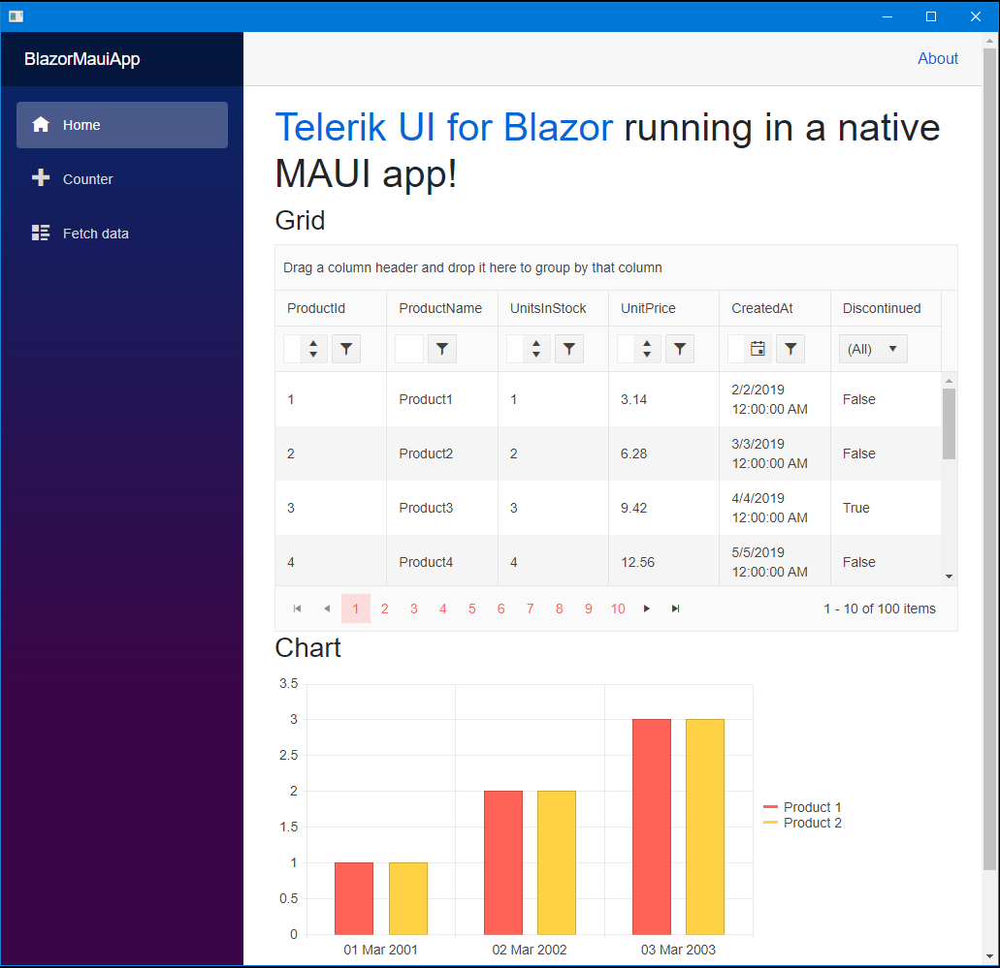
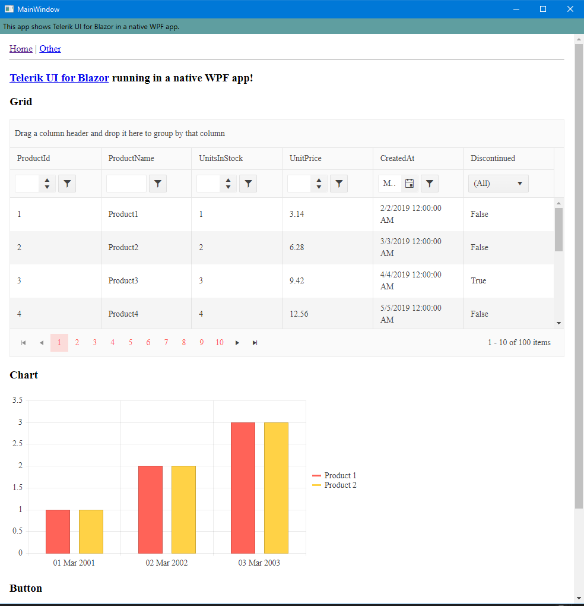

# Hybrid Blazor Apps (Blazor Web apps running in WinForms, WPF, MAUI)

## Overview

With .NET 6.0 an exciting new feature became available - `WebView` for native apps that is dedicated to running Blazor Web applications.

The samples in this project showcase Telerik UI for Blazor web components running in this hybrid scenarios inside native MAUI, WPF and WinForms apps.

## Screenshots

Here's how the hybrid apps look like when they are run on the different platforms with a similar configuration of Telerik UI for Blazor components:

### Telerik UI for Blazor MAUI App

### Telerik UI for Blazor WinForms App

### Telerik UI for Blazor WPF App

## Installation Prerequisites

You need to make sure you can run the corresponding technology stack and the basic Hybrid Blazor WebView in it **before** using the Telerik components. You can find some details in the [How to run](#how-to-run) section below.

## Key Points About the Telerik Components

Comments in the code offer some more insights, the key points pertaining to the Telerik components are:
* The native app project needs to reference the Telerik UI for Blazor package.
* You add the Telerik static assets in the `index.html` file as usual.
* The `TelerikRootComponent` should be added as a top-level component in the Blazor app. Since layouts are not supported yet, in this sample we add it to the `Main.razor` component.
    * Make sure that the Telerik root component matches the webview viewport. In this sample, we need to remove the default margin and padding from the body to ensure the content matches the viewport. An extra element in the layout provides paddings.
    * It is expected that layouts should be supported in the future so you would be able to set this up in the same way as with regular Blazor web apps.

These sample apps contain just a few commonly used Telerik components such as a grid, chart, button, date picker to showcase things work.

## How to run

1. Install [.NET 6.0 RC 1](https://devblogs.microsoft.com/aspnet/asp-net-core-updates-in-net-6-rc-1/).
    * Note: It requires <a href="http://visualstudio.com/preview" target="_blank">Visual Studio Preview for Windows</a> or <a href="https://docs.microsoft.com/visualstudio/releasenotes/vs2019-mac-preview-relnotes" target="_blank">for Mac</a>.
1. Install [WebView](https://devblogs.microsoft.com/aspnet/asp-net-core-updates-in-net-6-preview-3/#blazorwebview-controls-for-wpf-windows-forms).
1. Make sure you have WinForms/WPF/MAUI/etc. installed.
    * Note: WPF usually come as workloads through the Visual Studio installer, if you have not activated it previously go to the VS Installer and add them.
    * Note: For MAUI installation, follow the instructions in the official [blog post](https://devblogs.microsoft.com/aspnet/asp-net-core-updates-in-net-6-preview-4/#net-maui-blazor-apps)
1. Run a WinForms/WPF/MAUI app
    * Note: For the MAUI app, follow the instructions for how to run on [Windows](https://devblogs.microsoft.com/aspnet/asp-net-core-updates-in-net-6-preview-4/#windows)
1. Make sure you have the latest Telerik UI for Blazor version (2.24.0) in [your nuget feed](https://docs.telerik.com/blazor-ui/installation/nuget).

## Known issues

1. Running MAUI apps might require developer mode to be [enabled](https://stackoverflow.com/questions/36324300/ensure-that-target-device-has-developer-mode-enabled-could-not-obtain-a-develop)
1. iOS apps are not runnable on Windows - see the [blog post](https://devblogs.microsoft.com/aspnet/asp-net-core-updates-in-net-6-preview-4/#ios-and-mac-catalyst)
> You can’t currently run the app for iOS or Mac Catalyst from a Windows development environment,

## Notes

At the time of writing, this technology is in preview phase, and there may be difficulties and missing features. A few examples include:

* There is no debugging protocol exposed for the webview, so inspecting content and debugging is difficult.
* Access to native APIs from the Blazor Web app code is still to be exposed by the framework - at the moment you have to write your own calls to services and code from the native app that you need to explicitly expose.
* There are reports of difficulties getting MAUI to work. It is early days for it yet, and you need to ensure you can run it first, before adding Blazor to the mix.
* The WebView is not on the [list of officially supported browsers by Telerik UI for Blazor](https://docs.telerik.com/blazor-ui/browser-support). It has its specifics and differences from a standalone browser, and the hybrid blazor app integration should be considered a proof-of-concept for the time being. As the technology and framework matures, we will be monitoring it and we will consider adding it to the list of officially supported environments.
